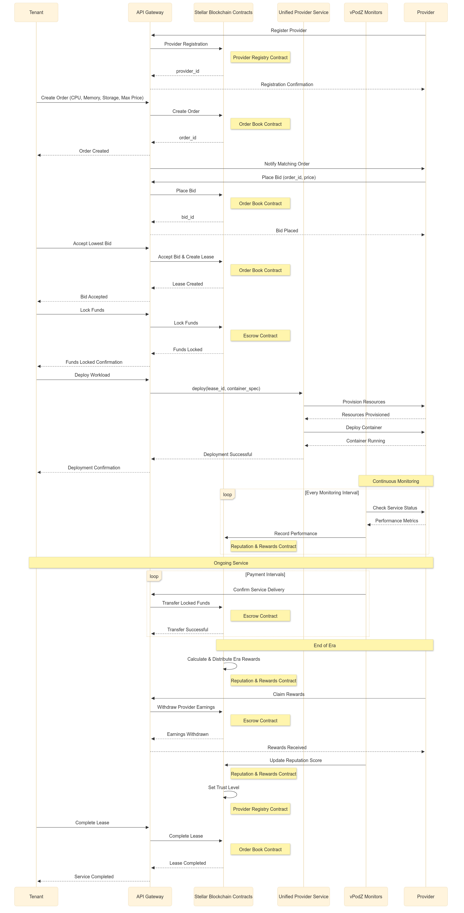
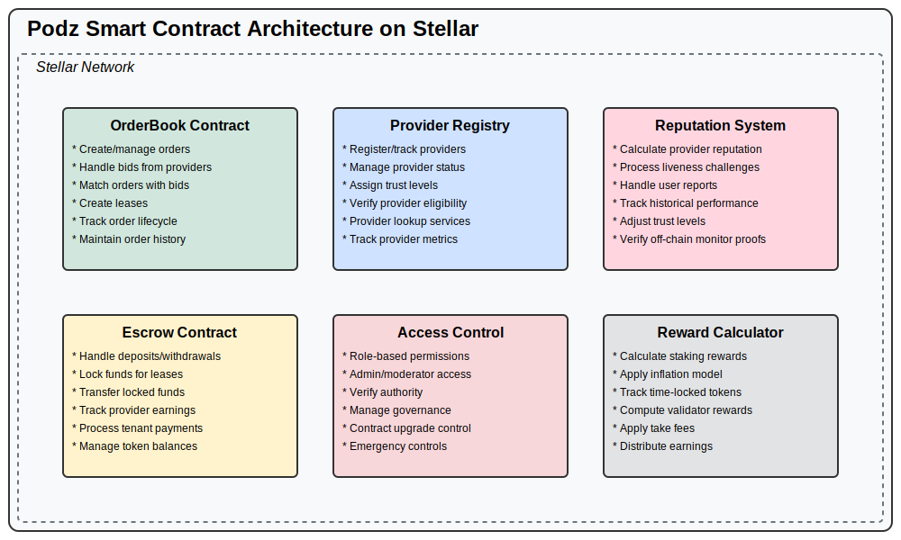

# PodZ: A Decentralized Cloud Computing Marketplace on Stellar

## Abstract

This paper presents PodZ, a decentralized cloud computing marketplace built on the Stellar blockchain that enables the efficient utilization of computing resources through a transparent marketplace. PodZ implements a serverless cloud infrastructure on Stellar's efficient consensus mechanism, enabling lower-cost cloud computing with simplified deployment workflows. By leveraging the Stellar ecosystem's advantages including fast settlement, low transaction costs, and multi-asset support, PodZ creates a viable alternative to centralized cloud providers while addressing the barriers to entry for both providers and users of cloud resources.

## 1. Introduction

Cloud infrastructure has grown into a multi-billion dollar industry dominated by a small number of large providers. The cloud computing market was valued at $32.4 billion in 2020 with projections to reach $210 billion by 2022. The market is largely controlled by three major providers—Amazon Web Services (AWS), Google Cloud, and Microsoft Azure—who collectively account for 71% of the market share. 

This centralized control has led to several inefficiencies. Traditional data centers utilize only 6% of their maximum computing output on average throughout the year, with up to 30% of servers being "comatose"—consuming electricity but not delivering useful computing services. Additionally, existing cloud service solutions are often inflexible, restrictive, and come with high recurring costs and vendor lock-in agreements.

PodZ aims to address these inefficiencies by creating a decentralized marketplace for computing resources built on the Stellar blockchain. The system repurposes unused computing capacity, making it available to users at lower costs while enabling providers to monetize their excess capacity.

## 2. Problem Statement

The current cloud computing landscape presents several challenges:

**2.1 Resource Inefficiency**
With 8.4 million data centers globally and an estimated 96% of server capacity underutilized, there is significant waste in computing resources. This inefficiency drives up costs for consumers while representing lost revenue opportunities for resource owners.

**2.2 Market Centralization**
The dominance of major cloud service providers creates an oligopolistic market structure with limited competition, resulting in higher prices and reduced innovation. These providers have established significant barriers to entry, making it difficult for new participants to enter the market.

**2.3 Complex Pricing Models**
Existing cloud providers implement complex and often opaque pricing structures, making it difficult for users to predict costs and optimize their resource usage effectively.

**2.4 Rigid Payment Systems**
Traditional cloud providers typically offer limited payment options, usually requiring credit cards or enterprise agreements, which creates barriers for users in regions with limited access to these payment methods.

#### 2.5 High Entry Barriers for Developers
New projects, particularly open source and community-driven initiatives, face significant challenges in accessing cloud resources due to high costs and complex infrastructure requirements.

### 3. Solution: PodZ Architecture



PodZ creates a two-sided marketplace connecting those who need computing resources (tenants) with those who have computing capacity to lease (providers). The system implements a reverse auction model where providers compete to offer the lowest price for tenant-specified requirements.

### 3.1 Core Components

PodZ consists of four main components:

1. **Smart Contract Layer**: A set of Soroban smart contracts on the Stellar blockchain that handle order creation, bidding, provider registration, and payment escrow.

2. **Unified Provider Service**: A middleware layer that standardizes interaction with diverse provider resources.

3. **Off-chain Monitors (vPodZ)**: Verification nodes that ensure service level agreements are met and trigger appropriate settlements.

4. **Client Interfaces**: Tools and SDKs that enable tenants to deploy workloads and providers to offer resources.

### 3.2 Key Technical Innovations

#### 3.2.1 Contract Layer - Stellar Soroban

PodZ leverages Soroban, Stellar's smart contract platform, to implement its core marketplace functions. The contract layer consists of:



- **Provider Registry Contract**: Manages the registration and status of providers, including trust levels and availability.
- **Order Book Contract**: Handles the creation of resource requests, bidding, and matching of tenants with providers.
- **Escrow Contract**: Manages fund locking, releases, and transfers between tenants and providers.
- **Reputation**: Yet to be implemented
- **Reward Calculator**: Yet to be implemented

#### 3.2.2 Unified Provider Service

The Unified Provider Service creates a standardized interface for diverse computing resources. This abstraction layer enables:

- **Resource Normalization**: Standardizing different types of computing resources into comparable units.
- **Deployment Management**: Handling the deployment of containerized applications across heterogeneous infrastructure.
- **Performance Monitoring**: Tracking resource utilization and application performance.

#### 3.2.3 Off-chain Monitors Deloyed on PodZ (vPodZ)

vPodZ nodes monitor the deployed on the PodZ to ensure compliance with service level agreements. These monitors:

- **Verify Uptime**: Check that services remain accessible according to the terms of the lease.
- **Validate Performance**: Ensure that the promised computing resources are being delivered.
- **Trigger Settlements**: Initiate payment transfers when conditions are met.
- **Report Violations**: Flag breaches of service level agreements.

vPodZ are earn rewards for successful reporting which are funded by the reward wallet. Adding the most important token utility for circular economy

### 3.3 Economic Model

PodZ implements a marketplace mechanism designed to:

1. **Optimize Resource Allocation**: Direct computing resources to their most valuable use through price signaling.
2. **Reduce Waste**: Incentivize the utilization of otherwise idle computing resources.
3. **Enable Flexible Pricing**: Allow dynamic price discovery through an auction mechanism.

Each marketplace transaction follows this workflow:

1. A tenant requests a deployment by specifying resource requirements and maximum acceptable price.
2. Qualified providers bid to fulfill the request, competing primarily on price.
3. The lowest qualified bid is automatically accepted, creating a lease between the tenant and provider.
4. The tenant's funds are locked in escrow for the duration of the lease.
5. Upon successful service provision, funds are transferred to the provider.

## 4. Architecture Details

### 4.1 Contract Layer - Stellar Soroban

Stellar's Soroban smart contract platform provides several advantages for PodZ:

1. **High Transaction Throughput**: Stellar can process thousands of transactions per second, enabling rapid marketplace operations.
2. **Low Transaction Costs**: The minimal fees on Stellar reduce friction in the marketplace.
3. **Multi-Asset Support**: Native support for multiple assets enables flexible payment options.
4. **Deterministic Finality**: Quick and final settlement of transactions ensures clear ownership and obligation fulfillment.

The contract layer includes three primary contracts:

#### 4.1.1 Provider Registry Contract

This contract manages the registration and status of providers in the network:

```rust
// Key provider registry functions
pub fn add_provider(env: Env, address: Address) -> u64
pub fn set_trust_level(env: Env, from: Address, provider_id: u64, trust_level: TrustLevel)
pub fn set_provider_status(env: Env, from: Address, provider_id: u64, status: ProviderStatus)
```

Providers are assigned trust levels based on their reliability and performance history, influencing their ability to compete for certain tiers of service. The system implements five trust levels with corresponding point multipliers:

```rust
#[contracttype]
#[derive(Debug, Clone)]
pub enum TrustLevel {
    One,    // Multiplier: 2.0 - Highest trust level
    Two,    // Multiplier: 1.75
    Three,  // Multiplier: 1.5
    Four,   // Multiplier: 1.0
    Five,   // Multiplier: 0 - Probationary level
}
```

Each trust level has a threshold point requirement that providers must maintain to qualify for that level. Higher trust levels offer advantages in the marketplace including priority in bid matching and higher reward multipliers.

#### 4.1.2 Order Book Contract

The Order Book Contract manages the marketplace for computing resources:

```rust
// Order state tracking
pub enum OrderState {
    Active,
    Closed,
    Complete,
}

// Bid management
enum BidState {
    Active,
    Canceled,
    Matched,
}
```

This contract handles the full lifecycle of orders, from creation to fulfillment, implementing the reverse auction mechanism that allows providers to compete on price.

#### 4.1.3 Escrow Contract

The Escrow Contract secures funds for lease agreements:

```rust
// Core escrow functionality
pub fn deposit(env: Env, token_address: Address, from: Address, amount: i128)
pub fn lock(env: Env, token_address: Address, from: Address, amount: i128)
pub fn transfer_locked(env: Env, token_address: Address, from: Address, amount: i128, provider: u64)
pub fn withdraw_provider_earnings(env: Env, from: Address, token_address: Address)
```

This contract ensures that tenants have sufficient funds for their deployments and that providers are compensated for their services, with payments released according to the terms of the lease agreement. Earnings are accumulated in the escrow until explicitly claimed by providers using the `withdraw_provider_earnings` function after lease completion.

#### 4.1.4 Reputation and Reward Calculator Contract

The Reputation and Reward Calculator Contract manages provider reputation scores and calculates rewards:

```rust
// Reputation tracking functions
pub fn record_performance(env: Env, provider_id: u64, uptime: u64, performance_score: u64)
pub fn update_reputation_score(env: Env, provider_id: u64)
pub fn get_provider_reputation(env: Env, provider_id: u64) -> ReputationScore

// Reward calculation functions
pub fn calculate_era_rewards(env: Env, era_id: u64)
pub fn distribute_rewards(env: Env, era_id: u64)
pub fn get_unclaimed_rewards(env: Env, provider_id: u64) -> u128
pub fn claim_rewards(env: Env, provider_id: u64, to: Address)
```

The contract implements an era-based reward distribution system, where rewards are calculated and distributed at the end of each era (a fixed time period). The reputation score influences the reward multiplier according to the provider's trust level, with higher trust levels receiving proportionally higher rewards.

Reputation scores are calculated based on:
- Service uptime
- Performance against SLA requirements
- Successful lease completions
- User ratings
- Historical consistency

The reward calculation formula applies the trust level multipliers (2.0, 1.75, 1.5, 1.0, 0) to the base rewards, ensuring that reliable providers are incentivized to maintain high service quality.

### 4.2 Unified Provider Service

The Unified Provider Service abstracts the complexities of different computing infrastructures, presenting a unified API for deployment and management. Key features include:

- **Container Orchestration**: Managing the deployment of containerized applications across different provider infrastructures.
- **Resource Translation**: Converting standardized resource requests into provider-specific configurations.
- **Network Management**: Handling networking configuration to ensure connectivity between distributed components.

The service interfaces with both the blockchain contracts and the physical infrastructure, translating between on-chain agreements and off-chain deployments.

### 4.3 Off-chain Monitors (vPodZ)

vPodZ nodes provide a decentralized verification layer that ensures the integrity of the marketplace:

- **Consensus-Based Monitoring**: Multiple vPodZ nodes independently verify service provision, requiring consensus to confirm compliance.
- **Automated Settlements**: Triggering payments based on verified service delivery.
- **Dispute Resolution**: Providing evidence in case of disagreements between tenants and providers.
- **Performance Analytics**: Collecting data on provider performance to inform trust level assignments.
- **Reputation Reporting**: Submitting performance metrics to the Reputation and Reward Calculator Contract at the end of each era.

The monitoring system implements a challenge-response protocol to verify that services remain operational and meet the specified requirements. These performance metrics feed directly into the reputation system, which maintains a rolling history of provider reliability across multiple dimensions:

```
Performance Metrics Tracked by vPodZ Monitors:
- Service Uptime (%)
- Response Time Consistency (ms)
- Resource Availability (%)
- SLA Compliance Score
- Security Audit Results
```

At the end of each era (typically a 24-hour period), vPodZ nodes submit these metrics to the blockchain, where the Reputation and Reward Calculator Contract processes them to update provider reputation scores and calculate reward distributions based on the trust level multipliers.

## 5. Implementation Challenges and Solutions

### 5.1 Provider Quality Assurance

**Challenge**: Ensuring consistently high quality of service across diverse providers.

**Solution**: The trust level system in the Provider Registry Contract, combined with continuous monitoring by vPodZ nodes, creates a reputation system that incentivizes reliable service.

### 5.2 Resource Standardization

**Challenge**: Creating comparable units of computing resources across heterogeneous infrastructure.

**Solution**: The Unified Provider Service implements a standardization layer that normalizes different types of computing resources into consistent units for marketplace comparison.

### 5.3 Market Bootstrapping

**Challenge**: Initially attracting sufficient providers and tenants to create a liquid marketplace.

**Solution**: The integration with Stellar Community Fund projects creates an initial demand base, while incentive programs for early providers help bootstrap supply.

### 5.4 Regulatory Compliance

**Challenge**: Navigating varying regulatory requirements across jurisdictions.

**Solution**: Leveraging Stellar's built-in compliance capabilities and implementing configurable rules to adapt to different regulatory environments.

## 6. Future Directions

### 6.1 Advanced Reputation System

Building on the current trust level framework, future development will focus on:

- **Reputation Transferability**: Allowing providers to leverage reputation across different marketplaces.
- **Multi-dimensional Trust Scoring**: Expanding beyond basic performance metrics to include security, data handling, and compliance dimensions.
- **Predictive Reputation Models**: Implementing machine learning to predict provider reliability based on historical patterns.
- **Staked Reputation**: Allowing providers to stake tokens against their performance guarantees.

### 6.2 Specialized Computing Markets

Future development will explore markets for specialized computing resources:

- **AI/ML Optimized Hardware**: Dedicated marketplaces for GPU and TPU resources.
- **Secure Computing Enclaves**: Trusted execution environments for sensitive workloads.
- **Storage-Optimized Solutions**: Specialized offerings for data-intensive applications.
- **Zero-Knowledge Computation**: Infrastructure for privacy-preserving computation.

### 6.3 Enhanced Governance

Implementing decentralized governance mechanisms:

- **Parameter Adjustment**: Community voting on marketplace parameters.
- **Dispute Resolution**: Formalized processes for handling disagreements.
- **Feature Prioritization**: Community input on development priorities.
- **Reward Distribution Governance**: Community control over reward formula adjustments and trust level thresholds.


## 7. Conclusion

PodZ represents a significant advancement in decentralized cloud computing, leveraging the Stellar blockchain to create an efficient marketplace for computing resources. By addressing the inefficiencies of the current cloud computing market, PodZ enables more accessible, affordable, and flexible computing solutions.

The sophisticated reputation and reward system with its five trust levels (with multipliers of 2.0, 1.75, 1.5, 1.0, and 0) creates strong incentives for reliable service provision while enabling fair competition based on merit rather than market dominance. The era-based reward distribution ensures consistent evaluation of provider performance and transparent compensation.

PodZ's primary focus on AI agent deployment responds to the growing need for decentralized infrastructure capable of supporting autonomous AI systems without dependence on centralized cloud providers. Additionally, the integration with the Stellar ecosystem creates unique opportunities, particularly for projects within the Stellar Community Fund, while opening new economic possibilities for resource providers.

The combination of on-chain contracts for marketplace functions, reputation tracking, and reward calculation, coupled with off-chain monitoring for service verification creates a robust system that can challenge the dominance of existing cloud providers. The vPodZ monitoring network ensures that reputation scores accurately reflect actual performance, maintaining the integrity of the trust level system.

As the cloud computing industry continues to grow, PodZ offers an alternative path forward—one that emphasizes efficiency, accessibility, and community ownership over centralized control. By transforming computing power into a tradable commodity governed by transparent market mechanics and merit-based reputation, PodZ contributes to the vision of a more open and equitable computing infrastructure for the future of AI and decentralized applications.
